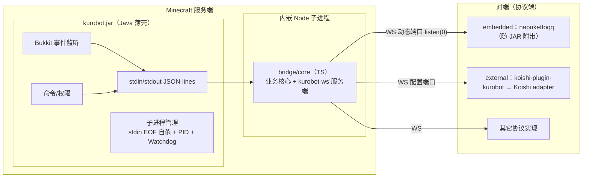

# KuroBot 架构书

> 状态：**设计定稿（2026-08-10）**。工程体系借鉴 NapukettoQQ（文档分层 / biome+tsconfig / pnpm workspace / 测试设施）。本文是架构 SSOT，改动先更新本文再动代码。

## 1. 定位与范围

KuroBot = MC 服务器插件（Paper JAR，Java），全自研，MIT 开源。群服互通插件：通过 WebSocket 与机器人框架通信，实现「游戏 ↔ 社交平台」双向互通（QQ / TG / Discord / WhatsApp…）。

```
kurobot（Paper JAR）—— Java 薄壳 + 内嵌 Node 子进程（TS 业务核心）
```

**核心原则**：
1. **kurobot 永远是 WS 服务端角色**，对端（协议端）主动连它。embedded / external **不是架构差异，只是打包/配置差异**（config 一个开关）。
2. **kurobot 只认一套自研协议 `kurobot-ws`**，不关心对端是谁（内嵌 napukettoqq / 独立 napukettoqq / koishi-plugin-kurobot / 其它实现）。
3. **业务核心在 Node（TS）侧**，Java 只是 Bukkit 桥接薄壳——开发量 90% 落在 TypeScript。
4. **Koishi 形态 = 站在 Koishi 的 adapter 生态肩膀上**，把全世界社交平台统一成 session 接口；平台渲染（富文本/颜色码/长度收敛）只存在于 koishi-plugin-kurobot。

## 2. 架构总览



## 3. 两种模式

| | `mode=embedded`（默认） | `mode=external` |
|---|---|---|
| 内嵌 Node 业务核心 | ✅ 拉起 | ✅ 拉起 |
| 协议端 | 内嵌 napukettoqq（JAR 附带） | 外部对端（koishi-plugin-kurobot 等） |
| 开箱即用 | ✅ 控制台扫码 | 需另配 Koishi |
| 架构差异 | **无**，仅打包/配置差异 | |

> 注：早期「external 不拉内嵌进程」的结论已作废（ADR-006）——业务核心在 Node 里，两种模式都必须拉 Node。

## 4. 分层与依赖方向

```
bridge/protocol（@kurobot/protocol）   zod schema SSOT，零框架依赖
   ↑
bridge/core     业务核心 + 协议服务端；零 Node API、零框架（平台无关）
   ↑                    ↑
bridge/koishi   Koishi v4 壳层 + 平台渲染     bridge/embedded   esbuild 单文件，无 Koishi
   ↑                    ↑
（Koishi 生态 adapter：onebot/telegram/discord…）     platforms/je（Java 薄壳，JSON-lines IPC）
```

**关键规则**：
- `bridge/core` 禁止任何 Node API（`ws`/`process`/`fs`/`pino`），传输层与 logger 均为可注入接口，target ES2020 → **QuickJS（LSE）可跑**。
- Java 薄壳**不含协议逻辑**，只做 Bukkit 桥接 + JSON-lines IPC + 子进程管理。
- 平台渲染只出现在 `bridge/koishi`。

## 5. 进程模型与 IPC

- **Java ↔ Node**：stdin/stdout **JSON-lines**，零端口零配置（ADR-010）。请求-响应（UUID）+ 事件推送两种帧。
- **Node ↔ 对端**：WS，动态端口 `listen(0)`（embedded，避免僵尸进程占端口）或配置端口（external）。端口号经 IPC 从 Node 回传给 Java（日志展示/管理用）。
- **子进程生命周期**：stdin EOF 自杀 + PID 文件 + Watchdog 心跳 + 崩溃兜底重启。

## 6. 业务归属

| 数据/逻辑 | 归属 | 说明 |
|---|---|---|
| 群↔服绑定、白名单、指令权限、转发规则 | **bridge/core（TS）** | 配置 JSON 放 `plugins/kurobot/`，Node 读写，服主改 JSON |
| Bukkit API 桥接（事件/命令/权限/broadcast/executeCommand） | **Java 薄壳** | 模板化，~几百行 |
| 消息渲染、平台格式收敛 | **koishi-plugin-kurobot（TS）** | 唯一认识平台的地方 |
| 协议端（QQ 连接） | napukettoqq | 只做协议端，不做业务 |

## 7. 目录树

```
kurobot/
├── readme.md / AGENTS.md / lefthook.yml / mise.toml
├── package.json（仅脚本 + workspaces）/ pnpm-workspace.yaml
├── biome.json / tsconfig.json / vitest.config.ts / .editorconfig   # 对齐 NapukettoQQ
├── docs/
│   ├── architecture.md（本文）/ DECISIONS.md / STATUS.md
│   └── protocol/            # 协议说明文档（draft 等）
│       └── draft-v0.1.md    # 协议草案说明（schema 源见 bridge/protocol）
├── platforms/
│   ├── je/                  # Java 交付物根（Gradle，薄壳）
│   │   ├── build.gradle.kts / settings.gradle.kts
│   │   └── src/main/
│   │       ├── java/…       # 桥接代码（事件/命令/权限/IPC/进程管理）
│   │       └── resources/embedded/   # 构建期生成（gitignore）
│   └── be/                  # LeviLamina LSE（TS → 编译 JS），复用 bridge/core
├── bridge/
│   ├── protocol/            # @kurobot/protocol：zod schema SSOT
│   ├── core/                # @kurobot/bridge-core（平台无关）
│   ├── koishi/              # koishi-plugin-kurobot
│   └── embedded/            # 嵌入式瘦身对端（esbuild 单文件，打进 JAR）
├── tools/
│   ├── embed/               # 嵌入式打包（npm tarball + Node 运行时 + 产物拷入）
│   └── dev/                 # 沙盒脚本
└── sandbox/                 # 运行产物全 gitignore（Paper 服务端 / Koishi 实例）
```

未来扩展：`platforms/` 命名空间已为 `be/` 预留；fabric/velocity 在 `platforms/je/` 内加 Gradle 模块。

## 8. 技术栈矩阵

| 模块 | 语言 | 关键依赖 | 构建 | 测试 |
|---|---|---|---|---|
| `docs/protocol` | TS | zod（SSOT） | tsdown | vitest |
| `bridge/core` | TS | zod；零框架零 Node API | tsdown | vitest（+ fast-check，二期） |
| `bridge/koishi` | TS | Koishi v4 | Koishi 标准 | vitest + `@koishijs/plugin-mock` |
| `bridge/embedded` | TS | 无框架 | esbuild 单文件 | 集成测试（起真 WS server） |
| `platforms/je` | Java 21 字节码（工具链 25，target 21） | Paper API（compileOnly）+ Jackson | Gradle shadowJar | JUnit 5（IPC 编解码 + 进程生命周期） |
| `platforms/be` | TS → JS | `@levimc-lse/types` | 编译后 LL 直载 | vitest |

**苛刻度（对齐 NapukettoQQ）**：
- **TS 侧**：直接沿用 Napuketto 的 biome.json + tsconfig（`erasableSyntaxOnly`、`exactOptionalPropertyTypes`、`noUncheckedIndexedAccess`、`noFloatingPromises`、`noExcessiveCognitiveComplexity(15)`、`useNamingConvention`、`useErrorMessage`、organizeImports 全保留）。一份 biome 配置管 bridge/ + tools/ + platforms/be。
- **Java 侧（第一版）**：`-Xlint:all -Werror` + Spotless(Palantir) + JUnit 5 + JaCoCo 存在性门禁（行 ≥60%）。**Error Prone / NullAway 第一版不上**（ADR-011），薄壳定型后再评估。
- **协议防漂移门禁**：消息类型只能 import `@kurobot/protocol`（lint 规则强制）；改 schema 不更新消费方 → CI 红。

## 9. 嵌入式打包要点（沿用 Napuketto 许可证方案）

- `node.exe`（MIT）→ 进 JAR；`wrapper.node`（腾讯闭源）→ **不进 JAR**，运行期从 QQ 安装目录发现拷贝；stub 闭源件走 release 附带。
- 动态端口（`listen(0)`）避免僵尸进程端口占用问题。
- 子进程生命周期：stdin EOF 自杀 + PID 文件 + Watchdog 心跳 + 崩溃兜底。
- `tools/embed`：拉 npm tarball + Node 运行时 → `bridge/embedded` 产物 + `node.exe` 打包进 `platforms/je`。

## 10. 协议

协议草案见 [`docs/protocol/draft-v0.1.md`](protocol/draft-v0.1.md)。

要点：协议名 `kurobot-ws`；WS 子协议 `Sec-WebSocket-Protocol: kurobot-ws.v1`（大版本，握手期拒绝不兼容对端）+ `hello` 内 `protocolVersion`（小版本/能力协商）；帧 `{ header: { type, id }, body }`；绑定频道列表随 `hello` 上报 + `bindingsUpdated` 增量事件；UUID 请求-响应 + `msgContinue` 流式回报；业务心跳 + 假连接检测；指数退避重连。

## 11. 红线

1. Java 薄壳不写业务逻辑（绑定/权限/转发）。
2. `bridge/core` 不出现任何 Node API / Koishi API。
3. 消息类型不手写，只 import `@kurobot/protocol`。
4. 不引入 OneBot 11；不复制 HuHoBot / NapCat / NapukettoQQ 代码。
5. 嵌入式打包：`wrapper.node` 不进 JAR。
6. IPC 只用 stdin/stdout JSON-lines，Java 不碰端口。
